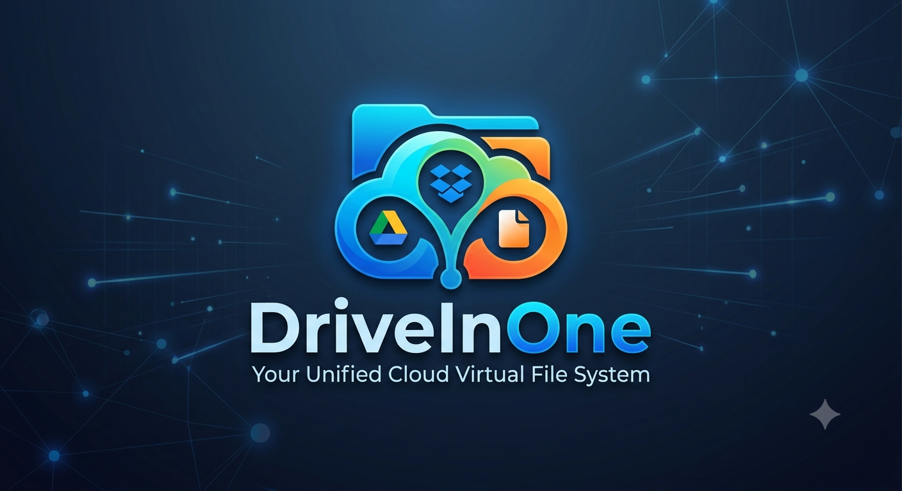

<p align="center">
  
</p>

# DriveInOne
> **One app. All your cloud storage. One unified drive.**

DriveInOne is a virtual file system that connects all your cloud storage accounts — Google Drive, Dropbox, and more — and presents them as a single unified storage space. Files too large for one provider are automatically split across multiple providers and seamlessly reassembled on download.

---

## Features

- **Unified Storage View** — Multiple Google Drive and Dropbox accounts appear as one pooled storage experience
- **Multi-Provider Support** — Files are distributed across connected providers automatically when needed
- **Multi-User Accounts** — Signup/login with hashed passwords and JWT-based sessions; each user manages their own set of connected providers
- **Web-Based OAuth Linking** — Connect Google Drive or Dropbox directly from the browser, no CLI required
- **Intelligent Distribution** — Greedy allocation fills providers by free space; large files are split across providers automatically
- **Chunk Reassembly** — Split files are downloaded and stitched back together transparently
- **SHA-256 Integrity Checks** — Every chunk and every file is verified on download
- **OAuth Authentication** — Short-lived tokens with refresh support per provider
- **Persistent Metadata** — PostgreSQL on Supabase tracks users, files, chunks, and provider info
- **Parallel Uploads** — All chunks upload simultaneously via threading
- **Storage Dashboard** — See connected providers, capacity, uploads, and downloadable files in-browser
- **REST API** — FastAPI backend with interactive docs at `/docs`
- **Download Progress UI** — Large downloads show visible progress in the web dashboard

---

## Architecture

DriveInOne uses a provider-based architecture. Each cloud storage service implements a common interface defined in `providers/base.py`. A greedy allocation algorithm distributes file chunks across providers, and a PostgreSQL database tracks all metadata needed for reassembly. A FastAPI layer exposes everything over HTTP, and serves the plain HTML/CSS/JS frontend directly as static files — the whole app runs as a single deployable service.

```
DriveInOne/
│
├── api/
│   ├── main.py            # FastAPI app — auth, upload, accounts, OAuth callbacks,
│   │                       # and static file serving for the frontend
│   ├── security.py        # Password hashing (bcrypt) + JWT creation/validation
│   ├── providers.py       # Shared provider-loading logic (CLI + API)
│   └── __init__.py
│
├── frontend/
│   ├── index.html         # Login / signup page
│   ├── dashboard.html     # Main app — provider cards, upload, file list
│   ├── app.js              # API client, auth/session helpers, toasts
│   └── style.css           # Design tokens and component styles
│
├── providers/
│   ├── base.py            # Abstract base class — upload_file, upload_bytes,
│   │                       # download_file, download_bytes, delete_file
│   ├── factory.py         # Factory for instantiating the correct provider
│   ├── gdrive.py           # Google Drive provider (OAuth 2.0, Drive API v3,
│   │                       # both Desktop-flow and web-redirect-flow support)
│   ├── dropbox.py          # Dropbox provider (OAuth 2.0 with refresh tokens,
│   │                       # both CLI-flow and web-redirect-flow support)
│   └── __init__.py
│
├── distribution/
│   ├── upload.py           # Greedy allocation + parallel chunk upload + DB recording
│   ├── download.py         # Chunk download + ordered reassembly + integrity checks
│   └── __init__.py
│
├── database/
│   ├── db.py               # PostgreSQL singleton connection (psycopg2)
│   ├── schema.sql          # Schema: users, providers, files, chunks tables
│   ├── users.py            # User creation/lookup (CLI + API paths)
│   ├── providers.py        # Provider registration/lookup queries
│   ├── files.py            # File and chunk metadata queries
│   └── __init__.py
│
├── tests/
│   ├── test_provider.py            # ABC and interface tests
│   ├── test_allocation.py          # Greedy allocation logic tests
│   ├── test_upload.py              # Upload, remote key naming, checksum, DB write tests
│   ├── test_download.py            # Reassembly, integrity verification, edge case tests
│   ├── test_gdrive_provider.py     # Mocked Google Drive provider tests
│   ├── test_dropbox_provider.py    # Mocked Dropbox provider tests
│   ├── test_auth.py                # Password hashing, JWT, signup/login/files endpoint tests
│   ├── test_upload_endpoint.py     # POST /upload endpoint tests
│   └── test_oauth_and_accounts.py  # State tokens, /accounts, OAuth authorize+callback tests
│
├── .github/workflows/
│   └── tests.yml           # CI: runs full test suite on every push
│
├── credentials/            # OAuth credential files (gitignored — see Google Drive Setup)
├── Dockerfile               # Container definition used for the Render deployment
├── setup.py                # Interactive provider registration CLI (local/dev use)
├── main.py                 # CLI entry point: storage summary, upload, download
└── requirements.txt
```

---

## Tech Stack

| Layer | Technology |
|---|---|
| Language | Python 3.13+ |
| Backend | FastAPI + Uvicorn |
| Auth | bcrypt password hashing, JWT (PyJWT, HS256) |
| Frontend | Plain HTML/CSS/JS — no framework, no build step, served by FastAPI |
| Database | PostgreSQL (Supabase) |
| Google Drive | Google Drive API v3, OAuth 2.0 (Desktop + Web client flows) |
| Dropbox | Dropbox API v2, OAuth 2.0 with refresh tokens |
| Testing | pytest + pytest-mock (fully mocked, no live credentials or DB needed) |
| CI/CD | GitHub Actions |
| Hosting | Render (Docker deployment — backend and frontend served from one service) |

---

## Getting Started

### Prerequisites

- Python 3.13+
- A Google account and/or Dropbox account
- A [Supabase](https://supabase.com) project (free tier is enough)

### Installation

```bash
git clone https://github.com/0jayer/DriveInOne.git
cd DriveInOne
python -m venv .venv
.venv\Scripts\activate        # Windows
# or
source .venv/bin/activate     # Linux/macOS
pip install -r requirements.txt
```


### Database Setup

Run the schema against your Supabase project:

```bash
# paste the contents of database/schema.sql into the Supabase SQL editor
# or use psql:
psql $DATABASE_URL -f database/schema.sql
```

### Google Drive Setup

DriveInOne uses **two** Google OAuth clients:

1. **Desktop client** — for the local CLI flow (`setup.py`)
   - Go to the [Google Cloud Console](https://console.cloud.google.com/), enable the **Google Drive API**
   - Create OAuth 2.0 credentials of type **Desktop app**, download the JSON
   - Place it at `credentials/google_credentials.json` (local use only — never deployed)

2. **Web client** — for the browser-based "Connect Google Drive" flow
   - Create a second OAuth 2.0 credential of type **Web application** in the same project
   - Under **Authorized redirect URIs**, add both:
     - `http://127.0.0.1:8000/accounts/gdrive/callback` (local dev)
     - your production callback, e.g. `https://your-app.onrender.com/accounts/gdrive/callback`
   - Download the JSON and place it at `credentials/google_credentials_web.json` for local dev

Both files are gitignored — they contain real secrets and must never be committed. For production, see **Deployment** below.

### Dropbox Setup

1. Go to the [Dropbox App Console](https://www.dropbox.com/developers/apps)
2. Create a new app with **Scoped Access**
3. Note your **App key** and **App secret** — add them to `.env` locally, and to your host's environment variables in production
4. Add both redirect URIs to the app's allowlist:
   - `http://127.0.0.1:8000/accounts/dropbox/callback` (local dev)
   - your production callback, e.g. `https://your-app.onrender.com/accounts/dropbox/callback`

### Running the app locally

DriveInOne's FastAPI backend serves the frontend directly, so a single process runs the whole app:

```bash
uvicorn api.main:app --reload
```

Open `http://127.0.0.1:8000` in a browser — sign up, log in, connect a provider, and upload a file. Interactive API docs are available at `http://127.0.0.1:8000/docs`.

**CLI (alternative, local-only):**
```bash
python setup.py    # register provider accounts via OAuth
python main.py     # storage summary, upload, download
```

```
=== Storage Summary ===
  Provider          Total       Used       Free
  ----------------------------------------------
  gdrive           16.11G      0.00G     16.11G
  dropbox           2.15G      0.00G      2.15G
  ----------------------------------------------
  TOTAL            18.26G      0.00G     18.26G

=== DriveInOne ===
  1) Upload a file
  2) Download a file
  3) Add another account
  4) Exit
```

---

## Deployment

DriveInOne is deployed as a single Docker service on [Render](https://render.com), which builds and runs the included `Dockerfile`. Because FastAPI serves both the API routes and the static frontend, there's no separate frontend host — everything lives at one URL [https://driveinone.onrender.com](https://driveinone.onrender.com).


### Redirect URIs — keep these in sync

Whenever the deployed URL changes, update the redirect URI in **three** places, or OAuth will fail with an `Invalid redirect_uri` error:
1. Google Cloud Console → OAuth client → Authorized redirect URIs
2. Dropbox App Console → redirect URI allowlist
3. Render environment variables (`GOOGLE_REDIRECT_URI`, `DROPBOX_REDIRECT_URI`)

---

## API Overview

| Method | Path | Auth | Description |
|--------|------|------|--------------|
| GET | `/` | — | Health check |
| POST | `/signup` | — | Create a new account |
| POST | `/login` | — | Verify credentials, returns a JWT access token |
| GET | `/files` | Bearer | List the authenticated user's files |
| POST | `/upload` | Bearer | Upload a file, distributed across the user's providers |
| GET | `/accounts` | Bearer | List connected providers with live capacity |
| GET | `/accounts/gdrive/authorize` | Bearer | Get the Google consent URL |
| GET | `/accounts/gdrive/callback` | — | Google OAuth redirect target — links the account |
| GET | `/accounts/dropbox/authorize` | Bearer | Get the Dropbox consent URL |
| GET | `/accounts/dropbox/callback` | — | Dropbox OAuth redirect target — links the account |

Full interactive documentation, including request/response schemas, is available at `/docs` once the server is running.

---

## How File Distribution Works

When you upload a file, DriveInOne:

1. Queries each of your connected providers for its current free space
2. Sorts providers by free space (largest first)
3. Fills each provider greedily — if the file fits in one provider, it goes there whole; if not, it's split at the provider's boundary
4. Uploads all chunks in parallel
5. Records the file metadata and every chunk's location, size, and SHA-256 checksum in the database

On download, it queries the database for the chunk list, downloads each chunk from the correct provider, verifies every chunk's checksum, stitches them in order, and verifies the final file checksum before returning it.

---

## Running Tests

```bash
pytest tests/ -v
```

All tests are fully mocked — no real API credentials or live database connection needed.

---

## Current Status

DriveInOne is now a working end-to-end cloud-storage distribution app with:

- Google Drive and Dropbox OAuth linking from the web UI
- Multi-account support for the same user
- Upload distribution across multiple providers
- Chunked download and reassembly
- Integrity verification and download progress in the dashboard
- A fully tested FastAPI backend and frontend flow
- Single-service deployment on Render 

No further roadmap items are planned for this version.

---

## License

This project is licensed under the Apache 2.0 License — see the [LICENSE](LICENSE) file for details.